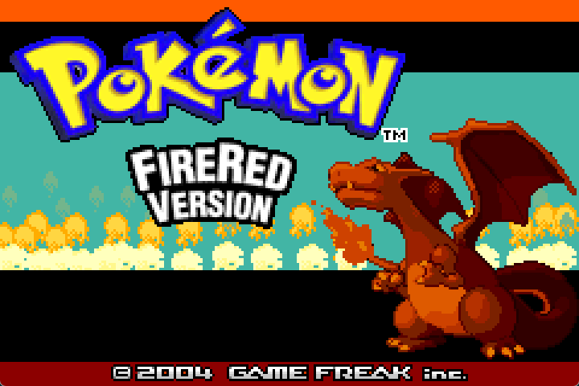
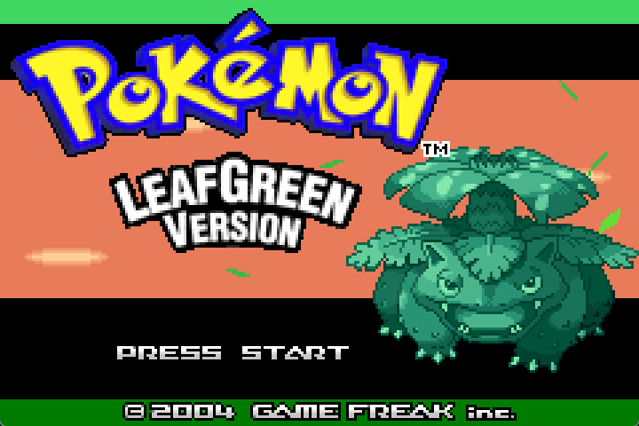
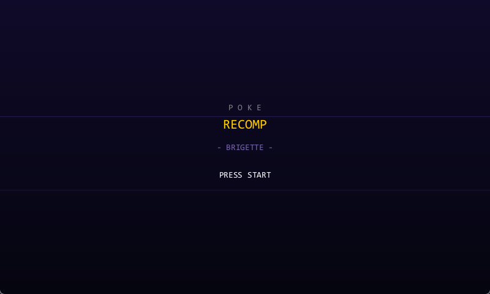
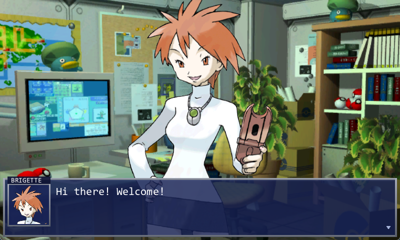
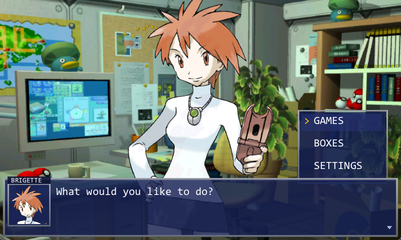
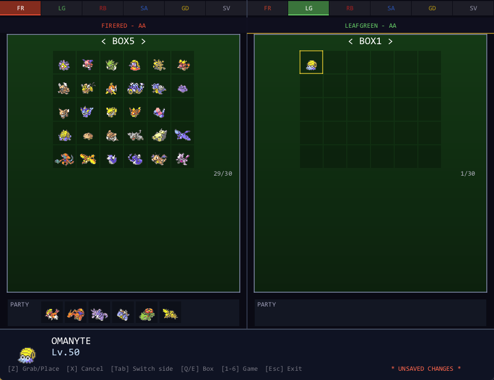
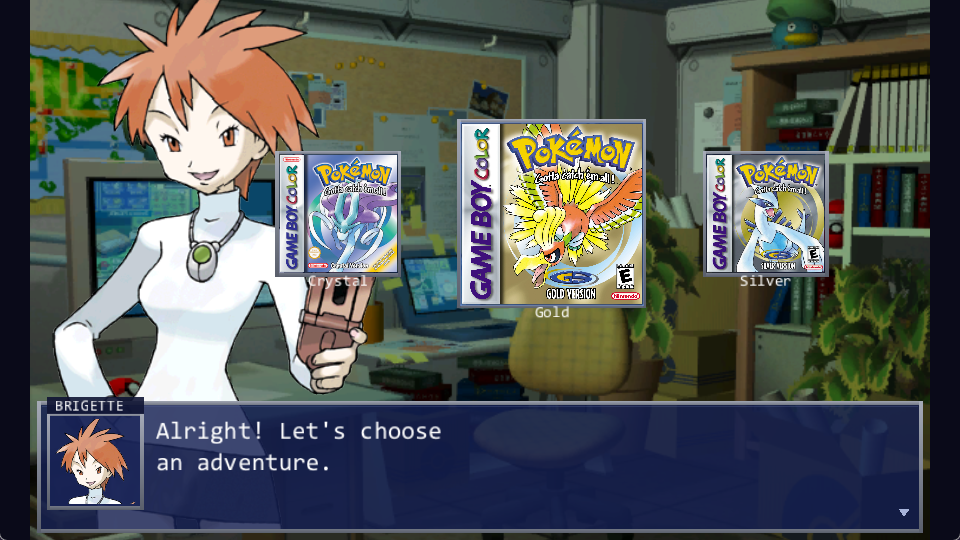
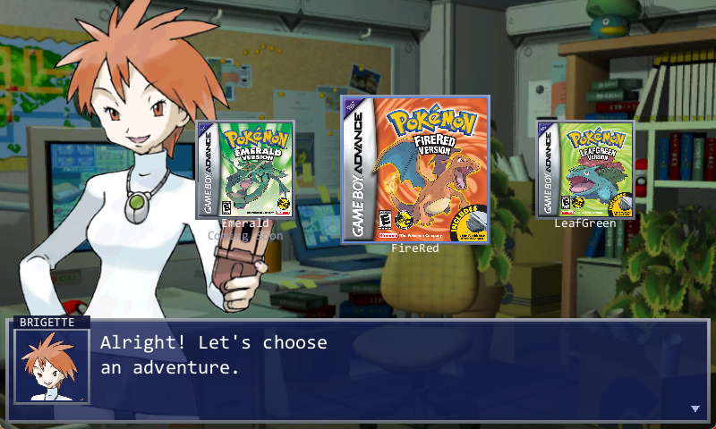
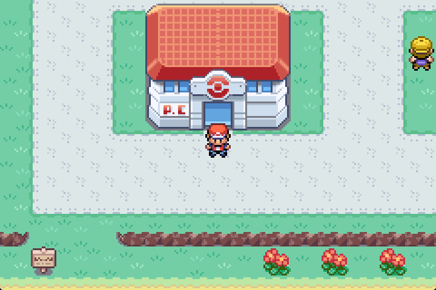
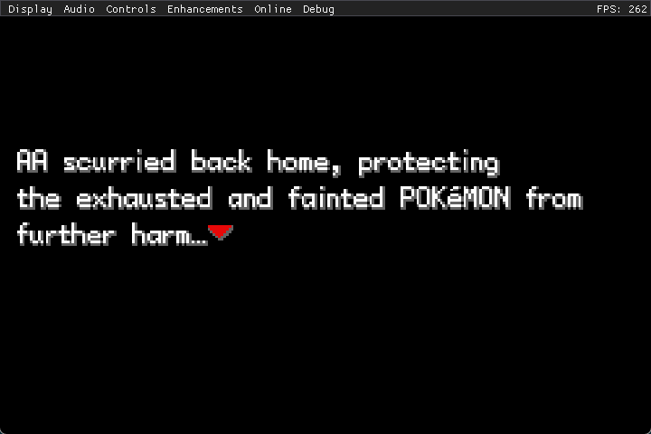

# PokeRecomp

A native PC port of the pret Pokémon decompilations. The game's C source is
compiled for x86 instead of ARM and linked against an SDL2 platform layer,
producing a standalone executable — no emulator involved.

One binary boots **FireRed, LeafGreen, Ruby, Sapphire, Gold, Silver, and
Crystal**, with cross-game Pokémon storage transfers and online multiplayer.

> **You need your own ROM.** No ROM image, and no graphics, music, or other
> binary asset, is included in this repository or in any release built from it.
> On first launch the launcher asks for a GBA/GBC ROM you legally own and
> extracts what it needs into a local `.pkmn` archive that stays on your machine.
>
> Like every decompilation project it builds on, this repository does contain
> game data in **source** form — stat tables, learnsets, map layouts, and script
> text. That material is copyrighted by its owners and is not licensed to this
> project. See [Legal](#legal).

---

## Screenshots

Running natively — no emulator:

| FireRed | LeafGreen |
|---|---|
|  |  |

| Launcher | Brigette |
|---|---|
|  |  |

| Main menu | Box transfer |
|---|---|
|  |  |

| Generation II select | Generation III select |
|---|---|
|  |  |

| FireRed overworld | LeafGreen in-game |
|---|---|
|  |  |

---

## Features

**Games**
- FireRed / LeafGreen — playable
- Gold / Silver / Crystal — playable, via recompiled GBC code
- Ruby / Sapphire — boots and battles, with known rendering issues

**Launcher**
- Generation and game selection with box art, hosted by Brigette
- Per-game ROM extraction into `.pkmn` archives
- Cross-game PC box transfer UI, including Gen 2 ↔ Gen 3 conversion
  (DVs → IVs, StatExp → EVs, encryption, OT names)

**Runtime**
- OpenGL 3.0 renderer with libretro shader support
- SDL2 audio: the GBA `m4a` engine plus a CGB audio implementation
- Gamepad support, configurable bindings, speed-up
- ImGui overlay (**F1**) — display, audio, controls, enhancements, online, map
  warps, and cheats

**Online multiplayer**
- Dedicated server, up to 64 players
- Shared overworld with visible players, nametags, and chat
- True PvP link battles and trades, tunneled over TCP
- Server-side account storage with per-player saves

---

## Building

Requires **MSYS2 / MinGW32** (32-bit is not optional — the game code assumes
32-bit pointers). In the **MINGW32** shell:

```bash
pacman -S --needed mingw-w64-i686-gcc mingw-w64-i686-SDL2 \
    mingw-w64-i686-SDL2_mixer mingw-w64-i686-SDL2_ttf \
    mingw-w64-i686-pkg-config make git python

git clone --depth 1 https://github.com/ocornut/imgui lib/imgui   # if lib/imgui is empty

make -f Makefile_pc -j$(nproc)
```

This produces `PokeRecomp.exe`. Copy it next to the DLLs (conventionally
`deploy/`) and run it.

Full instructions, dependency notes, multi-game object prefixing, and
troubleshooting: **[BUILDING.md](BUILDING.md)**.
Known build failures and their fixes: **[BUILD_FIXES.md](BUILD_FIXES.md)**.

> **Two build gotchas.** Never pipe `make` through `tail` — you get the pipe's
> exit status, so failures look like successes. And the link passes
> `-Wl,--warn-unresolved-symbols`, so a missing function does **not** fail the
> build; it produces a binary that jumps to a bogus address when called. After
> building, check:
> ```bash
> grep "undefined reference" linker_errors.txt | sed 's/.*undefined reference to //' | sort -u
> ```
> References prefixed `rb_`/`gd_`/`sv_` against libc are known-harmless
> prefixing artifacts. Anything else is a latent crash.

### Packaging a release

```bash
tools/pack_release.sh PokeRecomp-v1.0
```

Stages from an explicit allow-list and **refuses to produce an archive** if it
finds ROM data, `.pkmn` archives, saves, accounts, or logs — including a scan
for GBA ROM header signatures regardless of file extension.

---

## Online multiplayer

The full protocol, client architecture, remote-player rendering, and the
link-cable shim that makes PvP battles work are documented in
**[networking-explanation.md](networking-explanation.md)**.

### Building the server

```bash
make -f Makefile_pc server
```

That produces `PokeServer.exe` from a single translation unit (`server/server.c`,
~750 lines, no dependencies beyond `ws2_32`). It also builds on Linux:

```bash
gcc -O2 -Wall -o PokeServer server/server.c
```

### Configuring the server

Put a `server.cfg` next to the executable:

```ini
# IP address to bind to (0.0.0.0 = all interfaces)
localip = 0.0.0.0

# Port to listen on
hostport = 27015

# Message displayed in chat when a player joins
motd = Welcome to PokeRecomp!

# Server name shown in the console
server-name = PokeRecomp Server

# Maximum number of players (max 64)
max-players = 64

# Shiny encounter rate (1 in N chance, default 4096)
shiny-rate = 4096
```

`shiny-rate` is pushed to every client on connect, so shiny odds are controlled
server-side.

### Running the server

```bash
./PokeServer.exe
```

It listens on TCP `hostport` (default **27015**) — forward that port if you want
players outside your LAN. The server creates an `accounts/` directory next to
itself on first login.

### Connecting

In-game, press **F1** → **Online**, then fill in:

| Field | Meaning |
|---|---|
| IP | Server address (`127.0.0.1` for a local server) |
| Port | Must match `hostport` |
| Name | Username, max 16 chars — also your account name |
| Password | Hashed client-side (SHA-256) before it is sent |
| Trainer | Sprite other players see you as |

Press **Connect**. The first login with a given username **creates** that
account. On later logins the server streams your save down and the client boots
straight into it.

Once connected: other players appear in the overworld as real NPCs with
nametags, `/` opens chat, and walking up to a player and pressing A offers
**BATTLE** or **TRADE**.

### Accounts and saves

Accounts live in `accounts/<username>.dat` as a 32-byte SHA-256 password hash
followed by the 128 KB save. **While you are online, your save lives on the
server**, not on disk — the local flash image is overwritten at login and
uploaded back after each in-game save.

> Security note: passwords are unsalted SHA-256 over plaintext TCP, the first
> login silently claims a username, and the server does not validate anything a
> client reports. This is a design for private servers among people who know
> each other, not a hardened public MMO. Don't reuse a real password.

---

## Documentation

| Document | Contents |
|---|---|
| [BUILDING.md](BUILDING.md) | Toolchain setup, targets, deploying, packaging |
| [PORTING.md](PORTING.md) | How the port works and what it took to get here |
| [networking-explanation.md](networking-explanation.md) | Protocol, client, server, link-cable shim |
| [BUILD_FIXES.md](BUILD_FIXES.md) | Every known build failure and its fix |
| [CREDITS.md](CREDITS.md) | Attribution |
| [THIRD_PARTY_LICENSES.txt](THIRD_PARTY_LICENSES.txt) | Bundled library licenses |

---

## Legal

Pokémon FireRed, LeafGreen, Ruby, Sapphire, Gold, Silver, and Crystal — all
code, data, artwork, music, and text — are © **Nintendo**, **Creatures Inc.**,
and **GAME FREAK inc.** This project is not affiliated with or endorsed by any
of them and claims no rights to their work.

**No ROM image or binary asset is distributed here.** Graphics, music, and
sound are extracted at runtime from a ROM you supply.

As with the upstream decompilations this is built on, the repository does
contain game data in source form — stat tables (`extracted_data/`), map
layouts, and script text, including Ruby dialogue ported for the Hoenn content
(`hoenn-postgame/`). None of that is licensed to this project; it is present
for the same reason it is present in any decompilation, and the MIT license
below does not extend to it.

The port code in this repository is MIT licensed. That license covers only the
PC port itself — it cannot and does not relicense the upstream pret
decompilations, which are published without a license by their authors. See
[LICENSE](LICENSE) for the precise scope.

Bring your own ROM.

---

## Credits

This port stands on years of reverse engineering by the
[pret](https://pret.github.io/) teams, and its SDL2 platform layer was adapted
from [Kurausukun/pokeemerald @ `pc_port`](https://github.com/Kurausukun/pokeemerald/tree/pc_port).

Full attribution: **[CREDITS.md](CREDITS.md)**.
